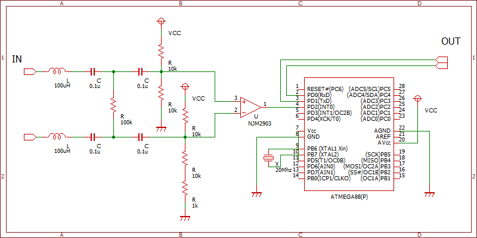
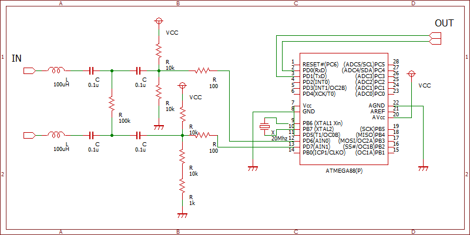

# インターホンをどうにかするやつ

基本的にメモやコード片なのでそのままでは使えないです．

## AiphoneCtrl.ino

Wi-Fiでインターホンをコントロールするやつ．回路図ないですがリレー等で操作する感じです．回路作る場合はmemo.mdも参照．

## avr/circuit

アイホンのエントランスと室内端末の通信を受信するやつ．(コード上には送信用の処理がありますが，怪しいので使わないでください)

AVR内蔵のアナログコンパレータでも動くようにしました．

コード中の USE_COMPARATOR を 1 にしてください． tiny13等の8ピンAVRでも動くので，ほぼそのままNJM2903を置き換えられます．

