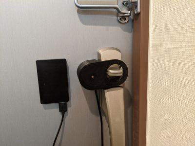

# ドアのサムターンを回すやつ

## 組み立て

必要なもの

| 部品 | 詳細 | 個数 |
| --- | --- | --- |
| サーボ | GWS MICRO/2BBMG | 1 |
| WiFiモジュール | Wio Node| 1 |
| ネジ | M3 x 4mm | 3 |
| 両面テープ| 強力なやつ | - |

-  modelsにあるSTLを適当な3Dプリンタで印刷(FDM方式ので十分です)
- ドアのタイプに合わせて高さなどの修正が必要です
- サーボの軸をギアに強引に押し込んでネジ止めしてください (金属製の軸じゃないと空転しやすいです)
- サーボはWio Nodeに直結

## 設置

- ドアには両面テープで貼り付けます
- 待機状態でリング状のギアの突起が45度傾いた状態にしてサムターンを回しても干渉しない位置に
- 待機状態から両側に回してどの位置でサムターンが回るか確認してコード上の定数を修正(通常70～80度)
